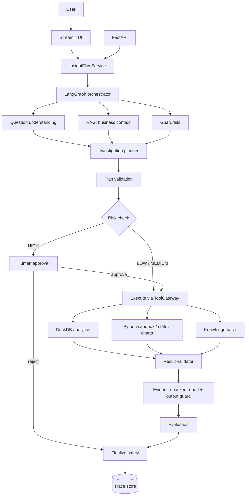
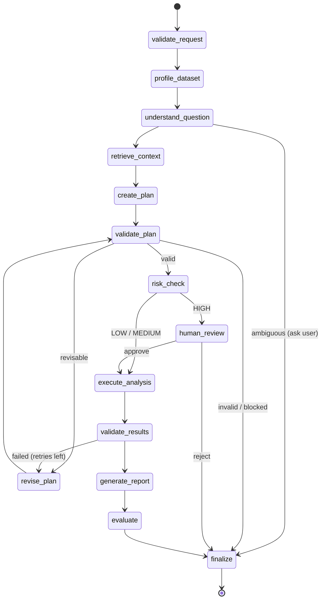

# InsightFlow AI

**A governed agentic analytics platform.** Upload a CSV or Excel file, ask a business question in plain English, and get an evidence-backed investigation report, like one a careful data analyst would write.

> *"Why did European revenue decrease in Q3, and which products contributed most to the decline?"*

InsightFlow does not simply let a chatbot write Python. It separates three concerns:

| Concern | Who is responsible |
|---|---|
| **Reasoning**: what is being asked, which analysis to run, how to interpret it | the LLM (or a deterministic rule-based reasoner) |
| **Computation**: SQL, aggregation, statistics, charts | deterministic tools (DuckDB, pandas, SciPy, Plotly) |
| **Authority**: which tools may run, what needs approval, which claims are supported | policy code the model cannot override |

Every number in the final report comes from an executed query and cites its evidence. Hypotheses are labelled as hypotheses, and risky actions pause until a human approves them.

---

## Contents

1. [Quick start](#quick-start)
2. [Connect any LLM](#connect-any-llm)
3. [What a run looks like](#what-a-run-looks-like)
4. [Architecture](#architecture)
5. [Why each technology](#why-each-technology)
6. [Security architecture](#security-architecture)
7. [Human-in-the-loop](#human-in-the-loop)
8. [Authentication, persistence and deployment](#authentication-persistence-and-deployment)
9. [Evidence and reports](#evidence-and-reports)
10. [Evaluation](#evaluation)
11. [Observability](#observability)
12. [Configuration](#configuration)
13. [Running tests and evaluations](#running-tests-and-evaluations)
14. [MCP servers](#mcp-servers)
15. [Running on an 8 GB laptop](#running-on-an-8-gb-laptop)
16. [Repository layout](#repository-layout)
17. [Known limitations](#known-limitations)
18. [Future production work](#future-production-work)

---

## Quick start

**Requirements:** Python 3.11+ and Git. No API key and no GPU are needed. By default the system runs fully offline.

```bash
git clone https://github.com/janupatiabhishek9-sudo/InsightFlow-AI.git
cd InsightFlow-AI

python -m venv .venv
# Windows:           .venv\Scripts\activate
# macOS / Linux:     source .venv/bin/activate

pip install -e ".[dev]"
python -m app.datagen                 # writes data/examples/sales.csv (deterministic)
```

**Run the web app** (one process):

```bash
streamlit run frontend/streamlit_app.py
```

Open http://localhost:8501, click **Use example sales dataset**, pick an example question, and click **Start Investigation**.

**Run the REST API** (optional):

```bash
uvicorn app.main:app --port 8000     # interactive docs at http://localhost:8000/docs
```

**Use a real LLM** (optional): copy `.env.example` to `.env` and paste **one** API key. See [Connect any LLM](#connect-any-llm).

**Run with Docker** (optional): `docker compose up --build` starts the API on port 8000 and the UI on port 8501.

---

## Connect any LLM

Paste a key into `.env` and it is picked up automatically (`LLM_PROVIDER=auto`). Then check it works:

```bash
python -m app.llm.check
# LLM_PROVIDER=auto -> using: anthropic
# anthropic/claude-opus-5: ok=True message='pong' tokens=...
```

| Provider | Put this in `.env` | Default model (override with `LLM_MODEL`) |
|---|---|---|
| Anthropic (Claude) | `ANTHROPIC_API_KEY=...` | `claude-opus-5` |
| OpenAI | `OPENAI_API_KEY=...` | `gpt-4o-mini` |
| Google Gemini | `GEMINI_API_KEY=...` (or `GOOGLE_API_KEY`) | `gemini-2.5-flash` |
| Groq | `GROQ_API_KEY=...` | `llama-3.3-70b-versatile` |
| Mistral | `MISTRAL_API_KEY=...` | `mistral-small-latest` |
| DeepSeek | `DEEPSEEK_API_KEY=...` | `deepseek-chat` |
| OpenRouter (hundreds of models) | `OPENROUTER_API_KEY=...` | `openai/gpt-4o-mini` |
| Together AI | `TOGETHER_API_KEY=...` | `meta-llama/Llama-3.3-70B-Instruct-Turbo` |
| xAI (Grok) | `XAI_API_KEY=...` | `grok-3-mini` |
| Ollama (local, free) | `LLM_PROVIDER=ollama` | `qwen2.5:3b` |
| Any OpenAI-compatible server (vLLM, LM Studio, LiteLLM, Azure OpenAI v1) | `CUSTOM_LLM_BASE_URL=...`, `LLM_MODEL=...`, optional `CUSTOM_LLM_API_KEY` | n/a |

- **Several keys set?** The first one wins, in the order of the table (Anthropic first). You can also force one with, for example, `LLM_PROVIDER=gemini`.
- **No key?** The app runs offline with the deterministic rule-based reasoner.
- **Default models** are only starting points. Model catalogues change, so set `LLM_MODEL` to any model your account offers.

How it works:
- **Claude** uses the official `anthropic` SDK with structured outputs (`messages.parse`), so replies are constrained to the stage's Pydantic schema. On `claude-opus-5`, server-side refusal fallbacks are enabled: if a safety classifier declines a request, the API retries it on a fallback model.
- **The other providers** use their OpenAI-compatible endpoints with JSON-schema output. If a server doesn't support that, the client falls back to JSON mode automatically.
- **Every reply is validated against a Pydantic schema.** One invalid reply is sent back to the model for correction. If it's still invalid, that stage falls back to the rule-based reasoner, and the trace records which one ran.
- **A rejected key (HTTP 401/403)** switches the LLM off for the rest of the session, with one clear log message, instead of failing at every stage.
- **The LLM never has authority.** Whatever it proposes still passes grounding, plan validation, the tool gateway, the SQL/code guards and the output guard.

---

## What a run looks like

Output for the flagship question on the bundled dataset (abridged, with real numbers):

```markdown
## Executive Finding
Europe revenue decreased by 27.8% from $1,697,962 in Q2 2024 to $1,226,096 in Q3 2024 (change: -$471,866).

## Main Contributors
- FACT: Country #1: Germany changed by -$222,906 (50.5% vs Q2 2024), 47.2% of the total change. [E4]
- FACT: Product #1: Laptop Pro changed by -$157,516 (33.5% vs Q2 2024), 33.4% of the total change. [E5]

## Detailed Analysis
- FACT: Orders went from 871 to 683, an effect of -$366,495. [E6]
- FACT: Effective discount went from 4.6% to 7.8%, an effect of -$42,764. [E6]

## Interpretation
- INTERPRETATION: By country, the change is concentrated: the largest contributor, Germany, accounts for 47.2% of it.

## Hypotheses
- HYPOTHESIS: Heavier discounting may reflect a promotion or competitive price pressure. Check promotion records.

## Limitations
- Data quality: 25 fully duplicated rows. ...
```

The report is followed by an evidence appendix: every `[E#]` maps to the exact SQL and result rows, and every `[C#]` to a retrieved document section. The UI shows the plan, SQL, charts, validation checks, tool calls and full trace.

The sample dataset is synthetic. It is generated with a known story (a Q3 2024 European decline concentrated in Germany, Enterprise buyers and two products) plus deliberate data-quality problems, so the system has a real answer to find.

---

## Architecture



### The LangGraph workflow

Each box is an explicit node. Conditional edges handle revision loops, human review and safe termination.



**Design change from the spec:** the spec placed risk analysis *after* execution. Here, risk is checked **before** execution, because approving a data modification after it has already run would be pointless. Output-side risk (unsupported claims) is handled after execution by the output guard.

### Reasoning stages have two interchangeable implementations

Each reasoning stage (question understanding, planning, SQL repair, report writing) has:

- a **rule-based** implementation. It is deterministic and runs offline. It is the default, and it is also the fallback.
- an **LLM** implementation behind a versioned prompt contract (`question_understanding_v1`, `planner_v1`, `sql_generation_v1`, `result_validator_v1`, `report_generator_v1`).

Both produce the same Pydantic schema. Both pass through the same deterministic grounding, plan validation and output guard. If the LLM fails, returns invalid JSON twice, or exceeds the token budget, the stage falls back to rule-based. The trace records which implementation and prompt version actually ran.

Prompts are modular, not one giant system prompt. Each renders fixed sections: *system policy, role, available tools, schema context, RAG context, current state, task, output schema, safety constraints, evidence requirements*. Untrusted content (dataset values, documents) is wrapped in `<untrusted_data>` tags.

---

## Why each technology

| Technology | Problem it solves | Simplest alternative | Why not the alternative | Failure mode | Replace later with |
|---|---|---|---|---|---|
| **LangGraph** | Explicit, branching, resumable workflow; pausing for human approval with checkpoints | A plain Python function chain | Human review needs pause/resume with persisted state, and revision loops need conditional edges | Graph bugs surface as routing errors; each node is wrapped so failures become a traced `failed` status | Any state-machine engine (Temporal, Prefect) |
| **DuckDB** | Fast, deterministic SQL over a file with no server | pandas only | SQL is auditable evidence; DuckDB can **disable file and network access** after loading, which is a hard security boundary | Large files hit the 1 GB memory limit | Warehouse (Snowflake, BigQuery) behind the same engine interface |
| **RAG** | Business definitions the data can't supply (what "revenue" or "Enterprise" means, fiscal calendar) | Hard-code definitions | Definitions change, differ per team and carry access levels; retrieval gives attribution and versioning | Wrong chunk retrieved; mitigated by attribution in the report and access filtering | Chroma / pgvector + a neural embedder (already pluggable) |
| **MCP** | A standard, typed tool interface other agents and IDEs can use | Only in-process function calls | Tools become reusable outside this app with the same policies | A misconfigured client gets denials, not access | Remote MCP servers with real authentication |
| **Pydantic** | Typed state, structured LLM output, API schemas | Plain dicts | Validation at every boundary; the LLM can't return malformed plans | Validation errors trigger a retry, then fallback | n/a |
| **Streamlit** | A useful UI in one Python file | Jupyter | End users need upload, approve/reject buttons and charts | UI-only; all logic lives in the service layer | React front end on the same API |

Two deliberate deviations from the suggested stack:

- **Vector store.** The spec suggested Chroma or FAISS. With about 20 knowledge chunks, a numpy matrix plus JSON metadata is faster to start, uses almost no RAM and has no native dependencies. The `KnowledgeBase` interface allows swapping in Chroma or FAISS later.
- **Embeddings.** The default is a dependency-free feature-hashing embedder. A real neural model (`fastembed:BAAI/bge-small-en-v1.5`, ONNX, no torch) is one setting away.

---

## Security architecture

Defense in depth. No single layer is trusted on its own.

| Layer | Where | What it does |
|---|---|---|
| **Input guard** | `app/security/input_guard.py` | Blocks policy-override, role-hijack, prompt-extraction, exfiltration, secret-access and code-execution requests |
| **Trust boundaries** | prompts, profiler, retrieval | Dataset cells and documents are wrapped as `<untrusted_data>`; instruction-like cells are flagged; injected documents are quarantined |
| **Grounding** | `reasoning/understanding.py` | Every metric, column, filter value and period is checked against the real data; unknowns become clarification questions, never guesses |
| **Plan validation** | `reasoning/planner.py` | Columns, values and periods exist; tools are registered and grantable; SQL and code pass their guards; step limits are respected |
| **Tool authorization** | `security/policies.py`, `tools/gateway.py` | Every tool declares permissions, risk, read-only status, timeout and typed input/output schemas; one gateway enforces permissions, budgets, both schemas and timeouts, and retries transient failures of read-only tools with backoff (writes are never retried) |
| **SQL guard** | `security/sql_guard.py` | Parses SQL with `sqlglot` (not regex): one SELECT/WITH only; no DDL/DML, `ATTACH`, `COPY`, `PRAGMA`, file/network/system functions, other tables or schema-qualified names |
| **Engine lock-down** | `tools/duckdb_engine.py` | After loading, `enable_external_access=false` and `lock_configuration=true`, so even SQL that slips past the guard can't read files; query timeout and row limits apply |
| **Code guard + sandbox** | `security/code_guard.py`, `sandbox.py`, `limits.py` | AST allow-list of imports and attributes → separate `python -I` process with an empty environment (no secrets), private temp dir, timeout, output cap → OS limits: memory cap and no child processes (Windows Job Object; `RLIMIT_AS`/`RLIMIT_NPROC` on Linux) → runtime audit hook blocking sockets, subprocesses and file access outside the sandbox |
| **Output guard** | `security/output_guard.py` | Every FACT must cite evidence, and every number in it must match computed evidence or appear verbatim in a cited document; otherwise it is downgraded to HYPOTHESIS. Uncited business definitions are removed |
| **Clearance** | `rag/retrieval.py`, `service.py` | Documents carry `access_level`; filtering happens *before* ranking; a caller's clearance comes from their API key and may be lowered, never raised |
| **API authentication** | `api/auth.py` | API keys mapped to a name, role and clearance; constant-time key comparison; role checks on every route |

**Permissions** (`READ_DATA`, `RUN_ANALYSIS`, `READ_KNOWLEDGE`, `WRITE_FILE`, `ACCESS_EXTERNAL_SYSTEM`, `SEND_EXTERNAL_MESSAGE`, `MODIFY_DATA`) are granted by configuration. `MODIFY_DATA` can be granted for a single step, and only by a recorded human approval. Nothing the model outputs can grant a permission.

The uploaded source file is **never modified**. An approved `DELETE` or `UPDATE` applies only to the investigation's in-memory working copy.

---

## Human-in-the-loop

Approval is **risk-based**. Read-only analysis runs without interruption; only HIGH-risk actions pause.

```text
⚠ ACTION REQUIRES APPROVAL
Tool:       execute_write_sql
Operation:  Non-read-only SQL
Reason:     Delete rows with negative revenue. The requested operation modifies data (working copy only).
Command:    DELETE FROM dataset WHERE "revenue" < 0
Risk:       HIGH
[APPROVE]   [REJECT]
```

The pause uses LangGraph's `interrupt()` with a SQLite checkpointer, so a paused investigation **survives a restart**. The reviewer's decision (who, when, approve/reject, comment) is stored in state and in the trace:
- **Approve** resumes execution with `MODIFY_DATA` granted to that step only.
- **Reject** ends the investigation safely with nothing executed.

Via the API: `POST /investigations/{id}/decision` with `{"approved": true}`. This requires the `approver` role. When authentication is on, the recorded reviewer is the authenticated caller, never a name supplied in the request.

---

## Authentication, persistence and deployment

**API keys and roles.** Set `API_KEYS` in `.env` as `name:key:role:clearance`, comma-separated:

```bash
API_KEYS=alice:<32+ random chars>:approver:restricted,bob:<32+ random chars>:analyst:internal
```

| Role | Can |
|---|---|
| `viewer` | Read datasets, investigations and traces |
| `analyst` | Also upload datasets and start investigations |
| `approver` | Also approve or reject risky actions |

- Clients send the key in an `X-API-Key` header.
- The clearance caps which knowledge documents that caller's investigations can retrieve.
- With `API_KEYS` empty, auth is off, which is meant for local development only.
- `GET /me` shows who you are authenticated as.

**Persistence.** Workflow checkpoints go to `CHECKPOINT_DB` (a SQLite file by default). Traces go to `data/traces/`. Uploaded datasets go to `data/raw/`.

**Docker.**

```bash
docker compose up --build        # API http://localhost:8000, UI http://localhost:8501
```

- One image serves both the API and the UI.
- It runs as a non-root user, with memory limits and a named volume for `data/`.
- The UI talks to the API over HTTP (set `API_KEY` in `.env` if auth is on).

**CI.** `.github/workflows/ci.yml` runs on every push and pull request:
- the test suite on Ubuntu (Python 3.11 and 3.12) and Windows (Python 3.12);
- the golden-set evaluation regression gate;
- a Docker build plus a `/health` smoke test.

---

## Evidence and reports

Every important claim follows **Claim → Evidence → Source → Calculation/Retrieval → Confidence**.

- Evidence types: `computed` (DuckDB/SciPy), `rag` (document section), `derived`, `user_provided`, `hypothesis`.
- Claims are labelled **FACT** (directly supported), **INTERPRETATION** (a reading of the evidence) or **HYPOTHESIS** (needs validation).
- Report sections: Executive Finding, Evidence, Main Contributors, Detailed Analysis, Business Context, Interpretation, Hypotheses, Assumptions, Limitations, Recommended Next Analyses, Evidence Appendix.

Before anything is reported, **result validation** checks:
- result schema, empty results and missing values;
- divide-by-zero, percentage arithmetic and time-period coverage;
- aggregation consistency: the breakdowns must sum to the period totals;
- the driver bridge (orders, basket size, list price and discount effects) reconciles exactly;
- critical totals match an **independent recalculation** through a separate query;
- the revenue column matches its documented definition.

---

## Evaluation

The evaluation scores the whole trajectory (**question → plan → tools → arguments → execution → results → validation → answer**), not just the final sentence. A numerically correct answer reached through an unsafe path still fails the safety metric.

- `evaluations/datasets/golden_questions.json`: **54 golden cases** across change analysis, rankings, trends, summaries, prompt injection and secret extraction, destructive SQL, human approval (approve and reject), clarification and unanswerable periods.
- **Metrics:** question understanding, planning, tool selection, SQL accuracy, numerical accuracy, answer accuracy, RAG retrieval (including "the confidential document was *not* retrieved"), evidence accuracy, safety, HITL behaviour, report quality, unsupported-claim rate, efficiency.
- **Numerical ground truth** comes from an independent **pandas oracle** (a different engine and code path than DuckDB), not from hard-coded numbers.
- **Regression gate:** `--baseline evaluations/baseline.json` exits non-zero if any metric drops by more than 0.02, so prompt or model changes can be compared.

Current result (rule-based mode): **54/54 cases pass**, with every metric at 1.0 and an unsupported-claim rate of 0.0. See the honest caveat under [Known limitations](#known-limitations).

Each run also self-evaluates online (evidence coverage, unsupported-claim rate, validation pass rate, tool success rate, latency), shown in the UI.

---

## Observability

Every investigation has an ID and writes `data/traces/<id>.json`. The trace contains:
- the question, provider, model version and **prompt versions** (including which stages fell back to rule-based), and the dataset and schema;
- the retrieved documents, the plan and its validation;
- every tool call with arguments, status, duration, attempts and error, plus all SQL;
- retry counts (plan revisions, result retries, tool retries);
- the results, validation checks, risk decision and **human decision**;
- the final report, evaluation, token usage, errors, and per-node timing events.

Traces are also written when a run pauses for approval. The UI shows the workflow progress live, node by node, while an investigation runs. Logs are structured JSON. Set `ENABLE_LANGSMITH=true` with an API key to also send LangGraph traces to LangSmith.

---

## Configuration

Copy `.env.example` to `.env`. Every setting has a safe default.

| Variable | Default | Meaning |
|---|---|---|
| `LLM_PROVIDER` | `auto` | `auto` (first key found), `rule_based` (offline), or a provider name from [Connect any LLM](#connect-any-llm) |
| `LLM_MODEL` | empty | Empty = the provider's default model |
| `ANTHROPIC_API_KEY`, `OPENAI_API_KEY`, `GEMINI_API_KEY`, ... | none | Provider keys (see [Connect any LLM](#connect-any-llm)) |
| `OLLAMA_BASE_URL`, `CUSTOM_LLM_BASE_URL` | `http://localhost:11434`, none | Local / custom endpoints |
| `TOKEN_BUDGET` | `60000` | Per investigation; after that the stages use rule-based |
| `API_KEYS`, `API_KEY` | empty | API authentication (see [Authentication](#authentication-persistence-and-deployment)) |
| `CHECKPOINT_DB` | `data/processed/checkpoints.sqlite` | Where paused workflows are persisted (`memory` to disable) |
| `SANDBOX_MEMORY_MB` | `1024` | Memory cap for sandboxed code |
| `EMBEDDING_MODEL` | `hashing` | or `fastembed:BAAI/bge-small-en-v1.5` (`pip install -e ".[embeddings]"`) |
| `VECTOR_DB_PATH`, `KNOWLEDGE_DIR`, `DATA_DIR` | `data/processed/vector_store`, `knowledge`, `data` | Paths |
| `DEFAULT_USER_CLEARANCE` | `internal` | `public` / `internal` / `restricted` |
| `MAX_TOOL_CALLS`, `MAX_RETRIES`, `MAX_PLAN_STEPS` | `12`, `2`, `8` | Agent loop control |
| `MAX_EXECUTION_TIME`, `QUERY_TIMEOUT`, `SANDBOX_TIMEOUT` | `120`, `15`, `20` s | Time limits |
| `UI_BACKEND` / `API_URL` | `local` | `http` makes Streamlit call the FastAPI server instead of running in-process |
| `ENABLE_LANGSMITH`, `LANGSMITH_API_KEY` | `false` | Optional tracing |

Secrets are read only from the environment, stored as `SecretStr`, never logged, and never passed to the sandbox.

---

## Running tests and evaluations

```bash
pytest                                   # 125 tests: unit, integration, security, API auth, UI (~2 min)
pytest -m "not integration"              # fast unit tests only

python -m app.evaluation.runner                                    # full golden set
python -m app.evaluation.runner --baseline evaluations/baseline.json   # regression gate
python -m app.evaluation.runner --only chg-01 sec-02 hitl-01       # a subset
```

The tests cover:
- **Security:** `DROP` and `DELETE`, file-reading SQL functions, subprocess and network access, filesystem traversal, prompt injection in the question, the dataset and documents, secret extraction, unauthorized tool invocation, clearance escalation.
- **The LLM code path:** tested offline with a scripted fake model and fake HTTP transports. This covers provider auto-detection, JSON-schema to JSON-mode fallback, the correction retry, Claude's `messages.parse` path, the rejected-key circuit breaker, and a fabricated number being caught by the output guard.
- **Production features:** a paused approval surviving a restart, API roles, reviewer identity, sandbox memory limits, tool retries, Excel upload.
- **The UI:** the real Streamlit app is driven headlessly (investigate, then approve) with Streamlit's `AppTest`.

---

## MCP servers

The same governed tool catalogue is exposed through three MCP servers (stdio):

```bash
python -m app.mcp_servers.analytics_server --dataset data/examples/sales.csv   # get_schema, profile_dataset, execute_sql, get_statistics
python -m app.mcp_servers.python_server    --dataset data/examples/sales.csv   # run_analysis (sandboxed), create_chart, run_statistical_test
python -m app.mcp_servers.knowledge_server                                     # search_business_docs, get_kpi_definition, get_data_dictionary
```

Each tool has typed input **and output** schemas generated from its Pydantic models (results come back as MCP structured content), and a description that states its permissions, risk and timeout. Every call runs through the same `ToolGateway`. MCP clients get only the default grants, so `execute_write_sql` is visible but always denied over MCP.

Inside the app, the agent calls the gateway in-process rather than over stdio. The policies are identical, and this avoids three extra processes on an 8 GB machine. The package is named `mcp_servers` so it can never shadow the `mcp` SDK.

---

## Running on an 8 GB laptop

- **One process:** Streamlit runs the service in-process by default. There is no database server, queue or vector-DB server.
- **DuckDB in-memory**, capped at 1 GB and 2 threads per investigation; at most 3 working copies are cached, least-recently-used first.
- **No model in RAM by default:** the rule-based reasoner needs none. For local LLMs, use a small quantized Ollama model (e.g. `qwen2.5:3b`) and only one at a time. A cloud LLM is the better choice for heavy reasoning.
- **Tiny RAG index:** hashing embeddings, a numpy matrix, and a rebuild only when the documents change.
- The Python sandbox starts a short-lived process only when generated code actually runs.
- Measured: the 13k-row example investigation completes in about 0.4 s in rule-based mode.

---

## Repository layout

```text
app/
  config.py, logging_config.py, datagen.py, service.py, main.py
  api/            routes.py, schemas.py, auth.py      REST API (FastAPI) with API-key roles
  domain/         question, plan, data, evidence, governance, report   typed Pydantic models
  graph/          graph.py, state.py, deps.py, nodes/  LangGraph workflow
  reasoning/      understanding, planner, execution, validation, reporting, llm_stages
  prompts/        contracts.py                        versioned prompt contracts
  llm/            client.py, check.py                 Anthropic / OpenAI-compatible (Gemini, Groq, ...) / Ollama / none
  tools/          duckdb_engine, profiler, sql_builder, periods, stats_charts, registry, gateway
  security/       policies, sql_guard, code_guard, sandbox(+runner), limits, input_guard, output_guard
  rag/            ingestion, embeddings, retrieval
  mcp_servers/    analytics_server, python_server, knowledge_server
  evaluation/     datasets, oracle, evaluators, runner
  observability/  tracing.py
frontend/streamlit_app.py
knowledge/        business/, data/, policies/           markdown with access-level metadata
evaluations/      datasets/golden_questions.json, baseline.json
data/             examples/sales.csv, raw/ (uploads), traces/, processed/ (vector store, checkpoints)
tests/
Dockerfile, docker-compose.yml, .github/workflows/ci.yml
```

---

## Known limitations

- **The golden set was written alongside the rule-based reasoner**, so 54/54 shows it has no regressions, not how well it generalises. Questions outside the supported patterns (change, ranking, trend, summary and simple modifications) will often end in a clarification request, which is the safe outcome but not always the helpful one.
- **The LLM providers have been tested offline only** (fake models and fake HTTP transports), not against live APIs. Run `python -m app.llm.check` and the evaluation gate after adding a key, and expect some prompt tuning per model. Some providers may reject complex JSON schemas; the client then falls back to JSON mode, or the stage falls back to rule-based.
- **Working copies live in memory.** Approved modifications apply to an in-memory copy of the dataset. After a restart, or when more than 3 investigations are active, the copy is reloaded from the source file. This is safe, because the source is never changed, but earlier modifications are gone.
- **Datasets and investigations are not owned per user.** Any authenticated caller with the right role can see all of them.
- **The Docker setup is verified by CI only.** It is not tested on this machine.
- **Prompt-injection detection is heuristic.** The structural defenses (grounding, authorization, SQL/engine lock-down, output guard) are what actually stop damage.
- **Hashing embeddings are lexical**, which is fine for a small curated knowledge base but weak for synonyms. Switch to `fastembed` for semantic search.
- The dataset needs a date column for time-based questions. The driver decomposition needs `quantity`, `unit_price` and `revenue` columns.

---

## Future production work

- Single sign-on (OIDC) instead of static API keys, with per-user ownership of datasets and investigations
- Postgres checkpoints and object storage for multi-instance deployments
- A task queue (Celery/RQ) behind the synchronous service seam, so long investigations don't hold an HTTP request
- Container-level sandboxing (gVisor/Firecracker) on top of the current process limits
- A warehouse connector implementing the DuckDB engine interface
- Evaluation against live models, and a larger golden set written independently of the implementation
